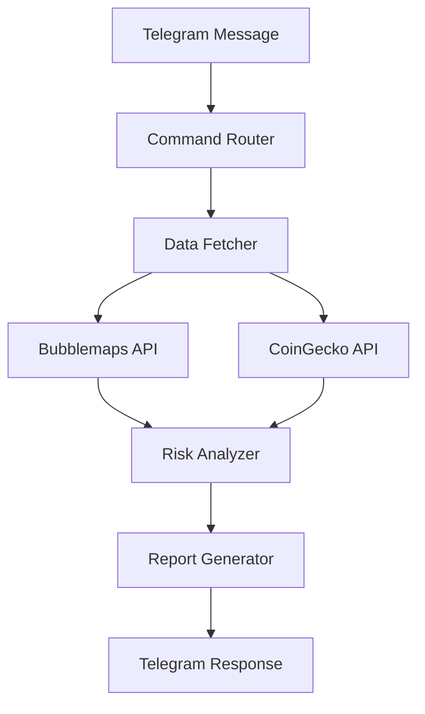

```markdown
# Bubblemaps Investigation Bot 🤖

A Telegram bot that analyzes token distribution patterns using Bubblemaps data, detects whale concentrations, and provides real-time risk assessments. Built for the Bubblemaps Hackathon.


## Features ✨

- 🕵️ Automated token supply analysis
- 📸 Playwright-powered Bubblemaps screenshots
- ⭐ Favorite token tracking
- 📊 Decentralization scoring system
- 🚨 Risk level classification
- 🔥 Trending token discovery

## Tech Stack ⚙️

- `Python 3.11`
- `python-telegram-bot`
- `Playwright` (Chromium)
- `Bubblemaps API`
- `CoinGecko API`
- `Docker` + `Render.com`

## Setup 🛠️

### Requirements
- Telegram bot token ([Get from @BotFather](https://t.me/BotFather))
- Bubblemaps API key
- CoinGecko API key (free tier)

### Installation
```bash
git clone https://github.com/yourusername/bubblemaps-bot.git
cd bubblemaps-bot

# Install dependencies
pip install -r requirements.txt
playwright install chromium

# Configure environment
cp .env.example .env
nano .env
```

### Environment Variables (`.env`)
```ini
TELEGRAM_TOKEN=your_bot_token
BUBBLEMAPS_API_KEY=your_bm_key
COINGECKO_API_KEY=your_cg_key
CACHE_EXPIRY=300  # 5 minutes
PORT=10000         # For Render health checks
```

## Deployment 🚀

### Docker
```bash
docker build -t bubblemaps-bot .
docker run -d --name bmbot -p 10000:10000 --env-file .env bubblemaps-bot
```

### Render.com Setup
1. New → Web Service
2. Connect GitHub repo
3. Environment:
   - **Build Command:** `docker build -t bubblemaps-bot .`
   - **Start Command:** `python -u bot.py`
4. Set env vars
5. Deploy!

## Usage Guide 📖

### Basic Commands
| Command | Description | Example |
|---------|-------------|---------|
| `/start` | Welcome message | `/start` |
| `/addfavorite` | Track token | `/addfavorite eth 0x...` |
| `/favorites` | List tracked tokens | `/favorites` |
| `/trending` | Top 5 by volume | `/trending` |
| `/stats` | Usage statistics | `/stats` |

### Token Analysis
Send any token address:
```
eth 0x1f9840a85d5af5bf1d1762f925bdaddc4201f984
```
Bot responds with:
1. Supply distribution chart
2. Risk assessment
3. Market data
4. Direct Bubblemaps link

## Architecture 🏗️



## Troubleshooting ⚠️

**Common Issues:**
- "Failed to generate map" → Ensure Xvfb is running in Docker
- "Invalid address" → Verify chain support (eth, bsc, sol, etc.)
- Stale data → Check cache expiry (default 5min)

---