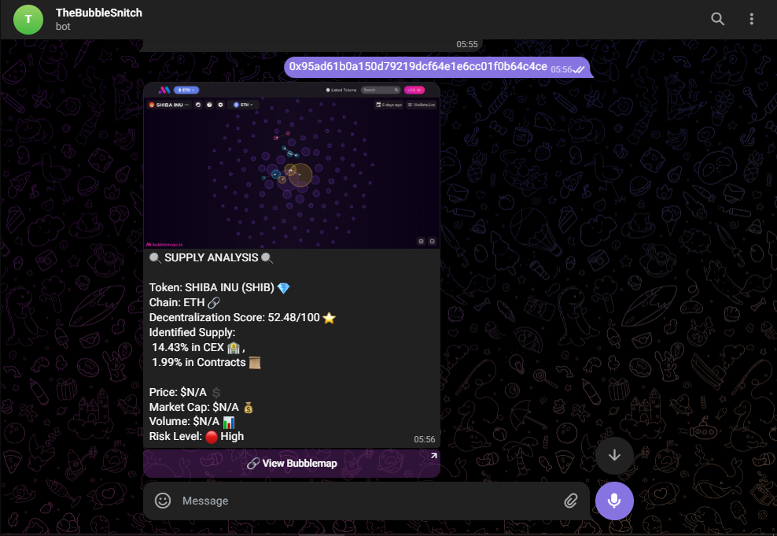
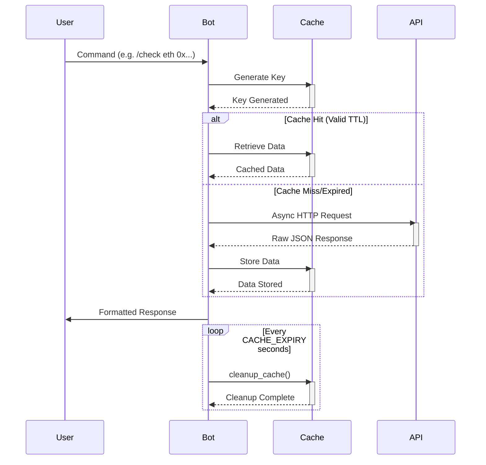
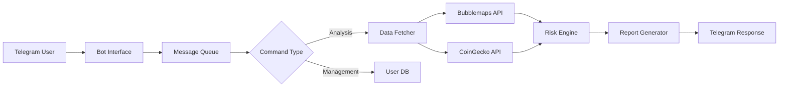

# 🗺️ Bubblemaps Telegram Bot

A Telegram bot for analyzing crypto tokens using Bubblemaps data. Generates bubble maps, provides market insights, and risk assessments.  
**Demo Bot**: [@TheBubbleSnitch_bot](t.me/TheBubbleSnitch_bot) 
**📖 Case Study**: Read the detailed write‑up [here](docs/CASE_STUDY.md).

## Table of Contents
1. [Technical Overview](#1-technical-overview)  
2. [System Requirements](#2-system-requirements)  
3. [Installation Guide](#3-installation-guide)  
4. [Configuration](#4-configuration)  
5. [Core Methodologies](#5-core-methodologies)  
6. [Operational Guide](#6-operational-guide)  
7. [Deployment Architecture](#7-deployment-architecture)  
8. [API Documentation](#8-api-documentation)  
9. [Troubleshooting](#9-troubleshooting)  
10. [Contributing](#10-contributing)  

<a name="1-technical-overview"></a>
## 1. Technical Overview

### Key Components
| Component | Purpose | Key Technologies |
|-----------|---------|------------------|
| Telegram Interface | User interaction layer | `python-telegram-bot` |
| Data Pipeline | Fetching & processing chain data | `aiohttp`, `Bubblemaps API` |
| Analysis Engine | Risk scoring & pattern detection | Custom algorithms |
| Visualization | Bubblemaps screenshot generation | `Playwright`, `Xvfb` |
| Caching System | Reduce API calls & latency | Memory-based LRU cache |

## 🚀 Key Features
- **Auto-Generated Bubble Maps** using headless browser
- **Real-Time Market Data** (Price/Volume/Market Cap)
- **Decentralization Score** (0-100 scale)
- **AI Risk Assessment** (🟢 Low/🟡 Medium/🟠 Elevated/🔴 High)
- **Favorites System** with price alerts
- **Trending Tokens** leaderboard
- **Tutorial** for everday users

   ### 🤖 Smart Command Correction
   We all make typos! The bot automatically suggests corrections for common mistakes:
   - `start` → `/start`
   - `fav` → `/favorites`
   - `addfav` → `/addfavorite`
   - And [50+ other variants](https://github.com/Ksschkw/TheBubbleSnitchBot-2/blob/main/handlers/typos_and_messages.py)

   ### Why This Matters
   - 🛡️ **Prevents Frustration**: No more silent failures for typos
   - 🧠 **Context-Aware**: Understands 50+ common misspellings
   - 🚀 **Instant Help**: Suggests correct syntax immediately

## 📋 Command Reference
| Command | Parameters | Description | Example |
|---------|------------|-------------|---------|
| `/start` | None | Welcome message | `/start` |
| `/help` | None | Show commands | `/help` |
| `<chain> <address>` | Chain + Contract | Analyze token | `eth 0x1f984...` |
| `/addfavorite` | Chain + Contract | Save token | `/addfavorite eth 0x1f984...` |
| `/favorites` | None | List saved tokens | `/favorites` |
| `/removefavorite` | Chain + Contract | Remove token | `/removefavorite eth 0x1f984...` |
| `/trending` | [metric] | Top tokens | `/trending volume` |
| `/stats` | None | Usage stats | `/stats` |

## 🖼️ Example Output
 

<a name="2-system-requirements"></a>
## 2. System Requirements

### Minimum Specifications
```yaml
CPU: 1 Core (x86_64)
RAM: 512MB
Storage: 1GB
OS: Linux/Windows/macOS (Docker recommended)
```
### Dependency Matrix
| Package | Version | Purpose |
|---------|---------|---------|
| Python | 3.11+ | Core runtime |
| Playwright | 1.44+ | Headless browser control |
| Bubblemaps API | Legacy | Token distribution data |
| CoinGecko API | v3 | Market data feed |

<a name="3-installation-guide"></a>
## 3. Installation Guide

### Local Development
```bash
# Clone repository
git clone https://github.com/ksschkw/TheBubbleSnitchBot-2.git
cd TheBubbleSnitchBot-2

# Install system dependencies (Debian/Ubuntu)
sudo apt install -y libgtk-3-0 libnss3 libxss1 libasound2

# Setup virtual environment
python -m venv venv
source venv/bin/activate

# Install Python packages
pip install -r requirements.txt
playwright install chromium
```

### Docker Deployment
```bash
docker build -t thebubblesnitchbot .
docker run -it --rm -e TELEGRAM_TOKEN=your_token thebubblesnitchbot
```

<a name="4-configuration"></a>
## 4. Configuration

### Environment Variables
```ini
# Required
TELEGRAM_TOKEN=your_botfather_token

# Optional
CACHE_EXPIRY=300  # Seconds (default: 5min)
PORT=10000         # Health check port
LOG_LEVEL=INFO     # DEBUG/INFO/WARNING
```

### Supported Blockchains
```python
["eth", "bsc", "ftm", "avax", "cro", "arbi", "poly", "base", "sol"]
```

<a name="5-core-methodologies"></a>
## 5. Core Methodologies

### Risk Scoring Algorithm
```python
def compute_risk(score, vol, cex, contract):
    # Weighted multi-factor analysis
    risk_score = (
        0.5 * (score/100) +          # Decentralization (50% weight)
        0.2 * (1 - cex/100) +        # CEX exposure (20% weight)
        0.2 * (1 - contract/100) +   # Contract risk (20% weight)
        0.1 * (min(vol/5e6, 1))     # Liquidity (10% weight, $5M cap)
    )
    if risk_score >= 0.75:
        return "🟢 Low"              # >75% composite score
    elif risk_score >= 0.55:
        return "🟡 Medium"           # 55-74% composite score
    elif risk_score >= 0.35:
        return "🟠 Elevated"         # New tier for granularity
    else:
        return "🔴 High"             # <35% composite score
```

### Caching Strategy


<a name="6-operational-guide"></a>
## 6. Operational Guide

### Command Reference
```bash
# Add token to watchlist
/addfavorite eth 0x1f9840a85d5af5bf1d1762f925bdaddc4201f984

# Generate token report (manual)
eth 0x1f9840a85d5af5bf1d1762f925bdaddc4201f984

# Check global stats
/stats
```

<!-- ### Monitoring Endpoints
```bash
curl http://localhost:10000/health
# Returns: {"status": "OK", "timestamp": "2024-03-15T12:34:56Z"}
``` -->

<a name="7-deployment-architecture"></a>
## 7. Deployment Architecture

### Render.com Setup
```yaml
# render.yaml
services:
  - type: web
    name: bubblemaps-bot
    env: python
    buildCommand: pip install -r requirements.txt && playwright install chromium
    startCommand: python bot.py
    healthCheckPath: /health
    envVars:
      - key: TELEGRAM_TOKEN
        value: your_token
```

### System Diagram


<a name="8-api-documentation"></a>
## 8. API Documentation

### Bubblemaps API Integration
```python
@simple_cache()
async def fetch_bubble(chain, addr):
    """
    Fetches token distribution data from Bubblemaps
    
    Parameters:
    chain (str): Blockchain identifier (eth/bsc/sol)
    addr (str): Token contract address
    
    Returns:
    dict: {
        "holders": list,
        "transactions": list,
        "cluster_analysis": dict
    }
    """
```

<a name="9-troubleshooting"></a>
## 9. Troubleshooting

### Common Issues
| Symptom | Solution |
|---------|----------|
| "Browser initialization failed" | Verify Xvfb is running in Docker |
| "Invalid address format" | Check chain-specific requirements: ETH=0x..., SOL=base58 |
| Stale market data | Check CoinGecko API status, verify API URL |
| MDC dialog not closing | Update Playwright selectors in `playwright_sceenshot.py` |

### Log Analysis
```bash
# Sample log output
[INFO] 2024-03-15 12:34:56 - Bot initialized
[DEBUG] 2024-03-15 12:35:01 - CACHE MISS for fetch_bubble(eth, 0x...)
[WARNING] 2024-03-15 12:35:02 - Bubblemaps API response delayed
```

<a name="10-contributing"></a>
## 10. Contributing

### Development Workflow
```bash
# Run tests
pytest tests/

# Generate documentation
mkdocs build

# Submit PRs to 'dev' branch
git checkout -b feature/your-feature
```

### Code Standards
- PEP8 compliance (black formatter)
- Type hints for all functions
- Docstrings following Google style
- Unit test coverage >80%

## 📜 License
MIT License - See LICENSE
```