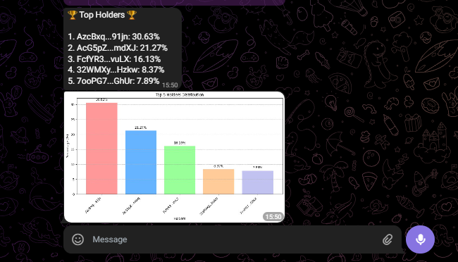

> **Executive Summary:**  
> thebubblesnitchbot is a Telegram bot that automates on-chain supply audits by fetching Bubblemaps graphs and parsing key metrics, all via a simple command. In our Magic Eden (ME) Solana example, the bot returns a **Decentralization Score: 2.47 / 100**, **Identified Supply: 1.22% CEX**, **0.63% Contracts**, **Price: $1.089**, **24h Volume: $79.64M**, **Market Cap: $162.69M**, plus an **🟠 Elevated** risk level computed by a weighted multi-factor algorithm. Beyond `<chain> <contract_address>`, it supports `/addfavorite`, `/favorites`, `/removefavorite`, `/trending`, `/tutorial`, `/tokendetails`, `/topholders`, and smart typo correction for over 50 variants, enhanced with inline buttons for deeper insights.

## 1. Introduction  
Bubblemaps is the first visual supply-auditing tool for DeFi tokens and NFTs, rendering the top 250 holders as interactive bubbles to reveal concentration and wallet interconnections.  
thebubblesnitchbot wraps Bubblemaps’ power into Telegram, using `python-telegram-bot` v21+ for command handling and Playwright for headless screenshots.

## 2. Bot Capabilities  
### 2.1 Core Analysis  
- **Auto-Generated Bubble Maps:** Captures live Bubblemaps graph via Playwright’s `page.screenshot()`.  
- **Real-Time Market Data:** Fetches price, volume, and market cap from CoinGecko’s public API, e.g., ME at $1.089 (vol $79.64M, cap $162.69M).  
- **Decentralization Score:** Parses the raw score (0–100) from the map’s DOM, indicating supply concentration at a glance.  
- **AI Risk Assessment:** Computes a composite risk level (Low/Medium/Elevated/High) using a weighted formula over decentralization, CEX exposure, contract supply, and liquidity.  
- **Top Holders:** Displays the top 3 holders with their addresses and percentages.  
- **Largest Transfer:** Shows the largest transfer between holders.  
- **Recent Transfers:** Lists the top 3 recent transfers between holders.  
- **Risk Analysis:** Provides a detailed risk analysis including top 10 holders' ownership and contract ownership.  
- **Related Tokens:** Shows tokens related to the current token with links to their Bubblemaps.

### 2.2 User Management  
- **Favorites System:**  
  - `/addfavorite <chain> <address>`: save tokens for quick access  
  - `/favorites`: list saved tokens  
  - `/removefavorite <chain> <address>`: remove from list  
- **Trending Tokens:** `/trending [metric]` shows top N tokens by volatility or volume, powered by an LRU-backed cache for efficiency.  
- **Interactive Tutorial:** `/tutorial` launches a multi-step, callback-driven guide for first-time users.  
- **Token Details:** `/tokendetails` provides detailed information about the current token.  
- **Top Holders:** `/topholders` lists the top holders of the current token.

### 2.3 UX Enhancements  
- **Smart Command Correction:** Automatically suggests correct syntax for over 50 common typos (e.g., `fav` → `/favorites`) by intercepting unknown commands and offering inline buttons.  
- **Rich Formatting:** Sends annotated captions with MarkdownV2 or HTML for bold/italic emphasis on key metrics.  
- **Inline Buttons:** Provides buttons for "Top Holders", "Recent Transfers", "Risk Analysis", and "Related Tokens" for quick access to additional information.

## 3. Architecture Overview  

*Figure 1: End-to-end data flow from Telegram → Playwright → Bubblemaps & APIs → Telegram.*  

1. **Telegram API** (polling mode) receives user commands via `Application.builder()`.  
2. **Command Handlers** route to modules in `handlers/` (`typos_and_messages.py`, `commands.py`, etc.) using `telegram.ext` framework.  
3. **Playwright Service** is initialized once (`post_init`) to launch a single headless Chromium instance for all screenshots.  
4. **Data Pipeline** scrapes Bubblemaps DOM, calls CoinGecko API for market data, and runs your custom `compute_risk()` algorithm.  
5. **Caching Layer** stores PNGs and API responses using an LRU strategy (`functools.lru_cache`) and a scheduled `cleanup_cache` job.  
6. **Response Formatter** builds a photo + caption payload and returns it to the user.

## 4. Detailed Demonstration (Magic Eden)  
Here’s how to use the bot with the Magic Eden (ME) token on Solana (`sol MEFNBXixkEbait3xn9bkm8WsJzXtVsaJEn4c8Sam21u`):

### 4.1 Starting the Bot  
Send `/start` to initialize the bot.  
  
*The bot responds with a welcome message and instructions.*

### 4.2 Invocation & Reply  
```text
sol MEFNBXixkEbait3xn9bkm8WsJzXtVsaJEn4c8Sam21u
```  
  
```text
🔍 SUPPLY ANALYSIS 🔍

Token: Magic Eden (ME) 💎
Chain: SOL 🔗
Decentralization Score: 2.47/100 ⭐
Identified Supply:
 1.22% in CEX 🏦 ,
 0.63% in Contracts 📜

Price: $1.089 💲
Market Cap: $162687476 💰
Volume: $79639188 📊
Risk Level: 🟠 Elevated
🏆 Top Holders 🏆
1. AzcBxq...91jn: 30.64%
2. AcG5pZ...mdXJ: 21.27%
3. FcfYR3...vuLX: 16.13%

💸 Largest Transfer: FWznbc... → 9cNE6K... (1567503.45 tokens)
```  
*The response includes inline buttons: "Top Holders", "Recent Transfers", "Risk Analysis", and "Related Tokens".*

### 4.3 Graph Capture  
  
*Figure 2.1: Captured Bubblemaps graph for ME.*

### 4.4 Top Holders (Button)  
Click the "Top Holders" button:  
  
```text
🏆 Top Holders 🏆

1. AzcBxq...91jn: 30.64%
2. AcG5pZ...mdXJ: 21.27%
3. FcfYR3...vuLX: 16.13%
4. 32WMXy...Hzkw: 8.21%
5. 7ooPG7...GhUr: 7.89%
```

### 4.5 Recent Transfers (Button)  
Click the "Recent Transfers" button:  
  
```text
💸 Recent Transfers 💸

1. FWznbc... → 9cNE6K...: 1567503.45 tokens
2. 6FEVkH... → 22Wnk8...: 347875.00 tokens
3. BmFdpr... → GL8T72...: 241502.00 tokens
```

### 4.6 Risk Analysis (Button)  
Click the "Risk Analysis" button:  
  
```text
⚠️ Risk Analysis ⚠️

Top 10 Holders Ownership: 94.88%
Contract Ownership: 0.18%
Risk Level: 🔴 High
```

### 4.7 Related Tokens (Button)  
Click the "Related Tokens" button:  
  
```text
🔗 Related Tokens 🔗

- WSOL (with link)
- USDC (with link)
- USDT (with link)
- ME (with link)
```

## 5. Code Deep Dive  
### 5.1 Bot Initialization (`bot.py`)  
```python
app = (
    Application.builder()
    .token(TOKEN)
    .post_init(init_browser)
    .post_shutdown(shutdown_browser)
    .concurrent_updates(False)
    .build()
)
app.job_queue.run_repeating(cleanup_cache, interval=300)
app.run_polling()
```  
- **`post_init`** keeps one browser alive, reducing startup overhead.  
- **JobQueue** triggers `cleanup_cache` to purge stale files (`os.remove`) based on `os.path.getmtime`.

### 5.2 Screenshot & Parsing (`core/playwright_screenshot.py`)  
```text
At first, I just used Playwright to directly take a screenshot of the page, but then I noticed that there is a pop-up that is usually blocking the bubble map, so I inspected the pop-up, looked for the element of the close button, and used Playwright's .click to close the pop-up and then take the screenshot.

View full implementation in `core/playwright_screenshot.py`
```  
- **Playwright’s** `page.screenshot()` returns PNG bytes directly.  
- **DOM Scraping** uses CSS selectors for metrics extraction.

### 5.3 Risk Computation (`utils/risk.py`)  
  
*Figure 3: Weighted multi-factor risk algorithm.*

## 6. Methodology & Reproducibility  
1. **Clone & Install**  
   ```bash
   git clone https://github.com/Ksschkw/TheBubbleSnitchBot-2 && cd YOUR_REPO
   pip install -r requirements.txt
   playwright install chromium
   ```   
2. **Configure**  
   ```bash
   echo "TELEGRAM_TOKEN=your_token_here" > .env
   ```  
3. **Run**  
   ```bash
   python bot.py
   ```  
4. **Interact**  
   - Invite **@TheBubbleSnitch_bot** to any chat  
   - Send `/start` or `<chain> <contract_address>`

## 7. Findings & Recommendations  
- **Magic Eden Insight:** The ME token exhibits a decentralization score of 2.47/100, with three significant holder clusters. The top 10 holders own 94.88% of the supply, and contract ownership is 0.18%. This high concentration of token supply suggests potential manipulation risks and warrants caution for investors. The risk level is rated as 🔴 High.

## 8. Conclusion  
TheBubbleSnitchbot delivers a seamless, 10-second audit—visual + quantitative—of token supply health, combining Bubblemaps, market data, and risk scoring into one polished Telegram experience with interactive features for deeper analysis.